# AI Image Generation Format Detection Algorithm

This document outlines the decision tree used by ImageDNA to identify the AI image generation platform that created an image, based on metadata embedded in the image file.

## Purpose

This decision tree serves multiple purposes:

1. **For library users**: Understanding why a particular format was identified
2. **For library contributors**: Clear guidelines for expanding format support
3. **For platform developers**: Insight into how their platform is identified
4. **For standards development**: Documenting the current ad-hoc identification approach

## The Detection Algorithm

ImageDNA uses a deterministic approach to identify the format of AI-generated image metadata. The algorithm works by examining three key aspects:

1. Where the metadata is stored in the image file
2. The structure of the metadata (JSON vs unstructured text)
3. Characteristic keys and values present in the metadata

### Decision Tree

```mermaid
graph TD
    CheckLoc([Source Location])
    
    CheckLoc --> ExifUserComment[EXIF UserComment]
    CheckLoc --> TiffImageDesc[TIFF ImageDescription]
    CheckLoc --> PngChunk[PNG Custom Chunk]
    CheckLoc --> PngMeta[PNG Metadata]
    CheckLoc --> NoDataLoc[No Data Found]
    
    ExifUserComment --> IsJson([Is JSON?])
    IsJson -->|Yes| CheckDTKeys([Has 'v2' key OR both 'c' and 'uc' keys?])
    CheckDTKeys -->|Yes| DrawThings[Draw Things]
    CheckDTKeys -->|No| CheckCivKeys([Has keys with 'civitai' OR 'cfg scale' OR 'ksampler' OR has 'resources' array?])
    CheckCivKeys -->|Yes| Civitai[Civitai]
    CheckCivKeys -->|No| Generic[Generic JSON]
    
    IsJson -->|No| UnstructuredText([Unstructured Text])
    UnstructuredText -->|Contains 'cfg scale'| CivitaiText[Civitai]
    UnstructuredText -->|Otherwise| DTText["Draw Things (legacy)"]
    
    TiffImageDesc --> TiffText([Unstructured Text])
    TiffText -->|Contains '--'| MidJourney1[MidJourney]
    
    PngChunk --> ChunkName([Check Chunk Name])
    ChunkName -->|Contains 'invoke'| InvokeAI[InvokeAI]
    ChunkName -->|Is 'comf'| ComfyUI1[ComfyUI]
    ChunkName -->|Is 'parameters'| CheckVersion([Check Version])
    CheckVersion -->|Contains 'fooocus'| Fooocus[Fooocus]
    CheckVersion -->|Otherwise| A1111_1[A1111]
    
    ChunkName -->|Other| CheckComfyContent([JSON has 'workflow' OR 'prompt' as object?])
    CheckComfyContent -->|Yes| ComfyUI2[ComfyUI]
    CheckComfyContent -->|No| Unknown1[Unknown Format]
    
    PngMeta --> PngMetaCheck([Check PNG Metadata])
    PngMetaCheck -->|'software' contains 'midjourney'| MidJourney2[MidJourney]
    PngMetaCheck -->|'software' contains 'stable diffusion'| A1111_2[A1111]
    PngMetaCheck -->|'rawText' contains '--'| MidJourney3[MidJourney]
    PngMetaCheck -->|Otherwise| Unknown2[Unknown Format]
    
    NoDataLoc --> NoData["¯\\_(ツ)_/¯"]
    
    %% Style for source locations
    style ExifUserComment fill:#ffcc99,stroke:#ff9900,stroke-width:2px
    style TiffImageDesc fill:#ffcc99,stroke:#ff9900,stroke-width:2px
    style PngChunk fill:#ffcc99,stroke:#ff9900,stroke-width:2px
    style PngMeta fill:#ffcc99,stroke:#ff9900,stroke-width:2px
    style NoDataLoc fill:#ffcc99,stroke:#ff9900,stroke-width:2px
    
    %% Style for formats
    style DrawThings fill:#d4f0fd
    style Civitai fill:#d4f0fd
    style MidJourney1 fill:#d4f0fd
    style MidJourney2 fill:#d4f0fd
    style MidJourney3 fill:#d4f0fd
    style ComfyUI1 fill:#d4f0fd
    style ComfyUI2 fill:#d4f0fd
    style InvokeAI fill:#d4f0fd
    style Fooocus fill:#d4f0fd
    style A1111_1 fill:#d4f0fd
    style A1111_2 fill:#d4f0fd
    style NoData fill:#d4f0fd
    style CivitaiText fill:#d4f0fd
    style DTText fill:#d4f0fd
```    

## Format Characteristics

### Draw Things
- **Location**: EXIF UserComment
- **Format**: JSON
- **Key Identifiers**: 
  - Contains "v2" key OR
  - Contains both "c" and "uc" keys

### Civitai
- **Location**: EXIF UserComment
- **Format**: JSON or unstructured text
- **Key Identifiers**:
  - JSON contains keys with "civitai" (case insensitive) OR
  - JSON contains keys with "cfg scale" (case insensitive) OR
  - JSON contains keys with "ksampler" (case insensitive) OR
  - JSON contains "resources" array OR
  - Unstructured text contains "cfg scale"

### MidJourney
- **Location**: TIFF ImageDescription or PNG Metadata
- **Format**: Unstructured text
- **Key Identifiers**:
  - Text contains "--" OR
  - PNG Metadata "software" field contains "midjourney" (case insensitive)

### ComfyUI
- **Location**: PNG Custom Chunk
- **Format**: JSON
- **Key Identifiers**:
  - Chunk name is "comf" (case insensitive) OR
  - JSON contains "workflow" object OR
  - JSON contains "prompt" as an object (not string)

### InvokeAI
- **Location**: PNG Custom Chunk
- **Format**: JSON
- **Key Identifiers**:
  - Chunk name contains "invoke" (case insensitive)

### Fooocus
- **Location**: PNG Custom Chunk
- **Format**: JSON
- **Key Identifiers**:
  - Chunk name is "parameters" AND
  - JSON contains "version" with "fooocus" (case insensitive)

### A1111 (Stable Diffusion WebUI)
- **Location**: PNG Custom Chunk or PNG Metadata
- **Format**: JSON
- **Key Identifiers**:
  - Chunk name is "parameters" but doesn't contain "fooocus" in version OR
  - PNG Metadata "software" field contains "stable diffusion" (case insensitive)

## Expanding Format Support

To add support for a new AI image generation platform:

1. Identify where the platform stores its metadata (EXIF, PNG chunk, etc.)
2. Document the unique identifiers for this platform (specific keys, values, or patterns)
3. Add a new case to the `ImageGenerationFormat` enum
4. Update the decision tree in the `identifyFormat` function
5. Add documentation for the new format in this document

## Notes for Platform Developers

If you're developing an AI image generation platform and want ImageDNA to properly identify your images:

1. Choose a unique location or naming convention for your metadata
2. Include a distinctive identifier in your metadata (e.g., a specific key or version string)
3. Consider adding a "format" or "generator" field explicitly identifying your platform
4. Maintain consistency in your metadata structure across versions

## Standards Consideration

The current state of AI image metadata is largely ad-hoc, with each platform using its own format and storage location. This document highlights the need for standardization in how AI image generation metadata is stored and identified.

Potential standardization could include:
- Reserved metadata fields for AI generation information
- Common schema for essential parameters (prompt, model, seed, etc.)
- Consistent location for storing this information
- Format versioning and identification

Until standards emerge, ImageDNA will continue to use this decision tree approach to provide the best possible identification of AI-generated images.
